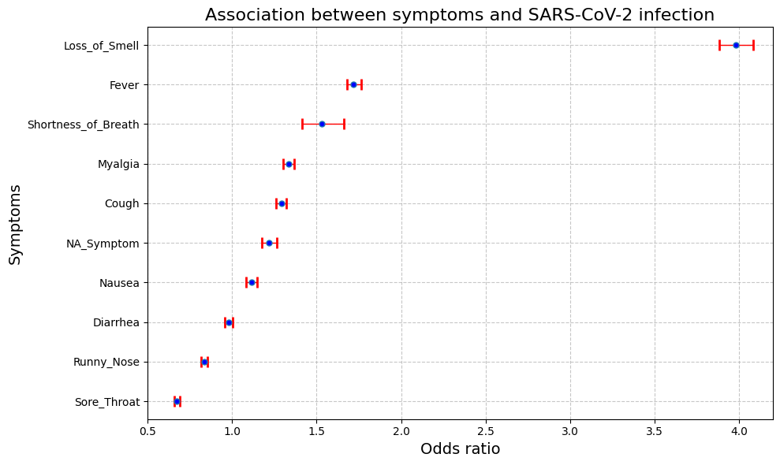
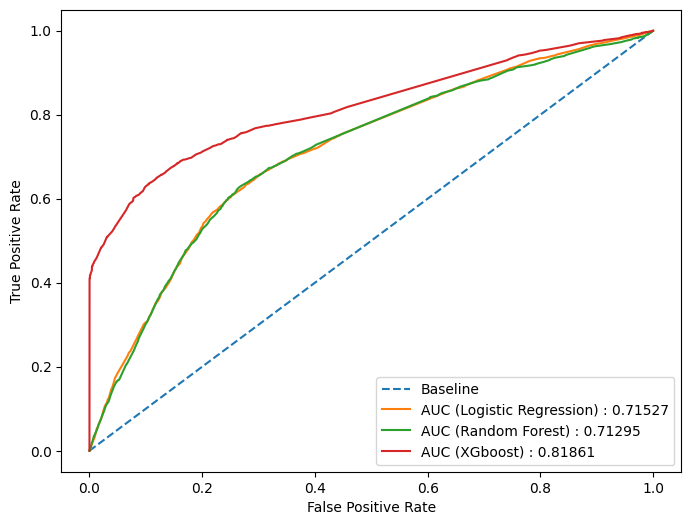
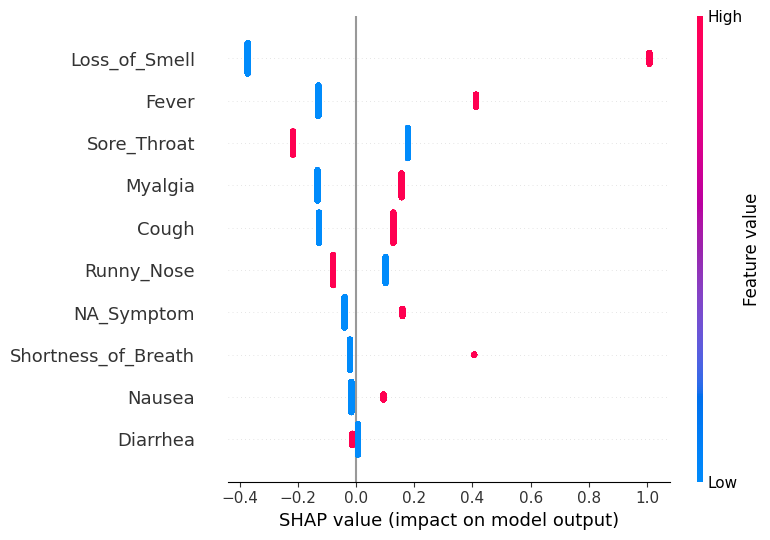
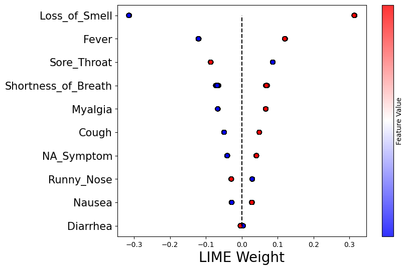
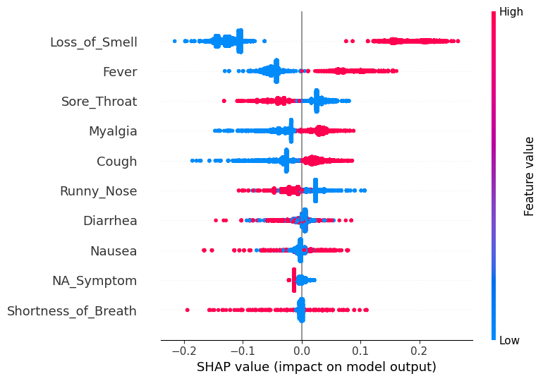
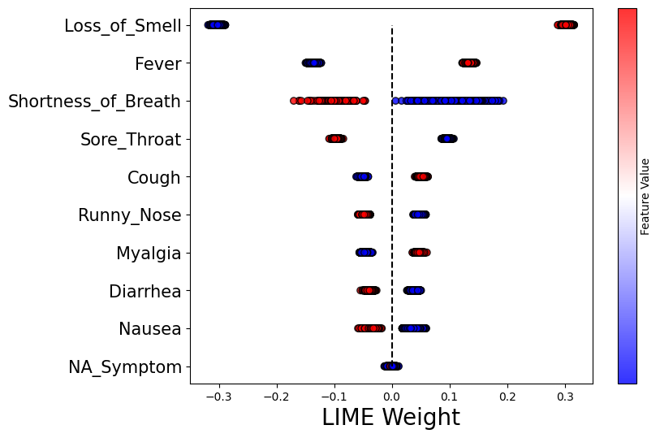
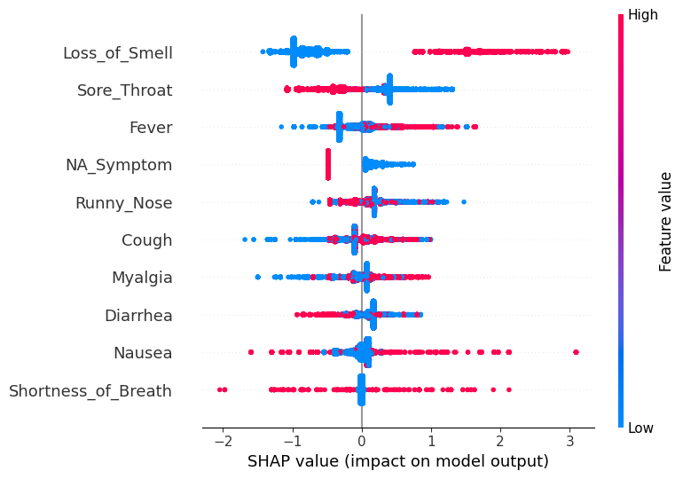
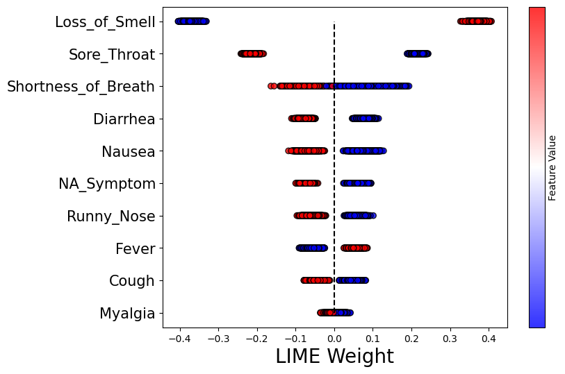

# SARS-COV-2-Prediction-based-on-symptoms
This repository focuses on predicting COVID-19 from symptom data, emphasizing interpretability by employing SHAP and LIME methods. Explore our investigation into how these local interpretability techniques can enhance understanding in medical diagnosis predictions for the SARS-CoV-2 pathogen

The project was funded by [CNPq](https://www.gov.br/cnpq/pt-br) (National Council for Scientific and Technological Development), supported by [BIOS](https://bi0s.unicamp.br/) (Brazilian Institute of Data Science), and carried out at the Data Analysis and Decision Support Laboratory ([LAD2](https://www.lad2.org/)), FCA/Unicamp.

The project was accepted for poster presentation at the Meeting on Codes, Lattices, and Information ([EnCoRi](https://ime.unicamp.br/encori/)):

## Contents
- [Exploratory Data Analysis(EDA)](#Exploratory_Data_Analysis(EDA))
- [Models](#models)
- [Interpretability methods](#Interpretability_methods)

## Exploratory Data Analysis (EDA)

### COVID-19 Dataset Summary

This dataset contains information on 63,872 participants who underwent testing for COVID-19, with detailed demographics and symptoms recorded for both positive and negative cases.

#### Participant Demographics and Testing Outcomes

| Category                 | Total (n = 63,872) | Positive Test (n = 9,105) | Negative Test (n = 54,767) |
|--------------------------|--------------------|----------------------------|----------------------------|
| **Participants, n (%)**  | 63,872 (100.0)     | 9,105 (14.26)              | 54,767 (85.74)             |
| **Female, n (%)**        | 38,970 (61.01)     | 5,437 (59.71)              | 33,533 (61.23)             |
| **Age, years, median [IQR]** | 41.0 [33.0 - 52.0] | 43.0 [34.0 - 54.0]        | 41.0 [33.0 - 52.0]         |
| **Health Professional, n (%)** | 30,653 (47.99) | 3,686 (40.48)              | 26,967 (49.24)             |

It is important to note that more than 80 percent of the patients tested negative for Covid, which draws our attention to the need to balance the data

#### Symptom Prevalence

| Symptom                  | Total (n = 63,872) | Positive Test (n = 9,105) | Negative Test (n = 54,767) |
|--------------------------|--------------------|----------------------------|----------------------------|
| **Fever, n (%)**         | 18,747 (29.35)     | 4,423 (48.58)              | 14,324 (26.15)             |
| **Cough, n (%)**         | 32,056 (50.19)     | 5,734 (62.98)              | 26,322 (48.06)             |
| **Sore Throat, n (%)**   | 27,671 (43.32)     | 4,037 (44.34)              | 23,634 (43.15)             |
| **Runny Nose, n (%)**    | 34,558 (54.11)     | 5,287 (58.07)              | 29,271 (53.45)             |
| **Myalgia, n (%)**       | 28,335 (44.36)     | 5,459 (59.96)              | 22,876 (41.77)             |
| **Nausea, n (%)**        | 9,261 (14.5)       | 1,865 (20.48)              | 7,396 (13.5)               |
| **Diarrhea, n (%)**      | 17,005 (26.62)     | 2,916 (32.03)              | 14,089 (25.73)             |
| **Loss of Smell, n (%)** | 17,111 (26.79)     | 5,176 (56.85)              | 11,935 (21.79)             |
| **Shortness of Breath, n (%)** | 1,136 (1.78)  | 312 (3.43)                | 824 (1.5)                  |
| **NA Symptom, n (%)**    | 12,212 (19.12)     | 1,022 (11.22)              | 11,190 (20.43)             |

This summary highlights the differences in symptom prevalence between participants who tested positive and those who tested negative for COVID-19. As an example, 56.85 percent of individuals who tested positive for Covid were diagnosed with loss of smell, while only 3.43 percent had shortness of breath

### Logistic regression adjusted for age and gender, for each symptom (remove the confounding effects of age and gender)

Thus, the odds of being diagnosed with Covid-19 is 3.981 higher given baseline Loss of Smell diagnosis compared to no baseline Loss of Smell!

## Models

Taking the area over the ROC curve as a metric, Xgboost showed the best results compared to Logistic Regression and Random Forest. However, having a model with high performance but poor interpretability, especially in the health sector, is not a good option, which is exactly why we need to resort to interpretable methods!

## Interpretability methods

| Summary plot - SHAP - Logistic Regression | Besswarm plot - LIME - Logistic Regression |
|------------------------------------------|------------------------------------------|
|  |  |

| Summary plot - SHAP - Random Forest | Besswarm plot - LIME - Random Forest |
|------------------------------------------|------------------------------------------|
|  |  |

| Summary plot - SHAP - XGboost | Besswarm plot - LIME - XGboost |
|------------------------------------------|------------------------------------------|
|  |  |

- It can be seen that the symptom relating to Loss of Smell was the most important in the interpretation of all the models used.

- Moreover, Shortness of Breath has a negative impact when the value is high in the LIME graphs (Random Forest and XGboost) and shows variability in the SHAP graph.

- When analyzing the symptom “Sore Throat”, it is also evident that the interpretability results converge. Although this attribute is relevant for both SHAP and LIME methods (ranking high in the ordering), the color distribution along the x-axis in all the SHAP and LIME results indicates that this symptom reduces the probability of patients testing positive for COVID-19. This finding is consistent with the the odds ratio for this symptom (approximately 0.67), meaning there is about a 33% reduction in the chance of a patient testing positive for COVID-19 when this symptom is present. 

## References

[1] Leila F Dantas and et al. App-based symptom tracking to optimize sars-cov-2 testing strategy
using machine learning. PloS one, 16(3):e0248920, 2021.

[2] Christoph Molnar. Interpretable Machine Learning. Github, 2 edition, 2022.